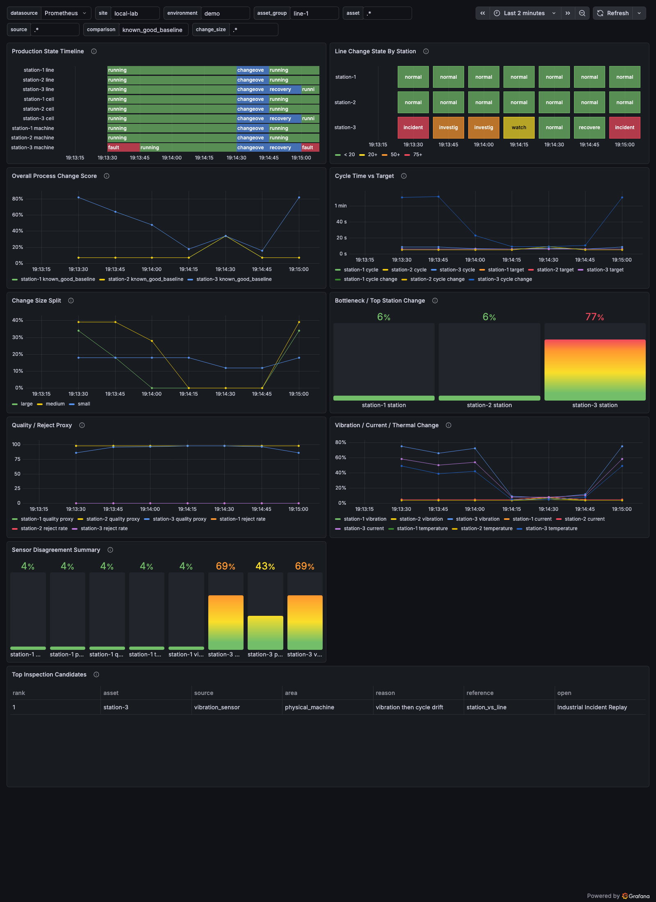

# MetricChrono Industrial Telemetry Recipe

This recipe helps industrial telemetry engineers see when a machine, station, line, sensor, or process cycle changed meaningfully before the failure becomes obvious in downtime, scrap, or alarms.

The local demo is synthetic and deterministic. It does not require OPC UA, PLCs, SCADA, historians, a machine, or a line. The default run plays once and holds recovery; pass `--loop` only when you explicitly want a repeating demo.



## Run The Grafana Demo

From the repository root:

```bash
make industrial
```

npm equivalent:

```bash
npm run industrial:start
```

Open the Grafana URL printed by the command. The dashboards are provisioned in the `MetricChrono Industrial Recipes` Grafana folder.

## Run The Fixture Scenario

```bash
cd recipes/industrial-telemetry/examples/synthetic-industrial-scenario
python3 run_scenario.py
```

The script writes `scenario-metrics.prom` as a Prometheus text snapshot for each phase. Use `fixtures/expected-metrics-normal.txt` and `fixtures/expected-metrics-incident.txt` as deterministic expected output.

## Three Terms

Change score:
0-20: normal variation
20-50: watch
50-75: investigate
75-100: incident candidate

Comparison:
The reference used to judge current behavior. This recipe uses domain comparisons such as `known_good_baseline`, `last_window`, `same_machine_state`, `peer_asset`, `station_vs_line`, `sensor_vs_sensor`, `source_vs_source`, and `current_vs_target`.

Change size:
`small` = jitter / noise / early movement, `medium` = operational deviation worth watching, and `large` = regime shift or incident candidate.

## What Ships

Default dashboards:
- Industrial Line Overview
- Machine / Process Agreement
- Industrial Incident Replay

Out-of-the-box concepts:
line, cell, station, machine state, cycle time, target cycle time, reject proxy, quality proxy, vibration, motor current, temperature, pressure, flow, controller state, sensor freshness, tag missingness, bottleneck, changeover, and fault state.

## Boundaries

This open recipe ships generic dashboard JSON, local synthetic scenarios, a metric contract, baseline guidance, alert examples, a panel guide, screenshots, and bounded demo fixtures. It does not control, halt, or safely operate machines, stations, or lines. It does not replace safety systems, PLC alarms, SCADA, historians, maintenance systems, quality systems, or incident policy.

See `docs/integration-guide.md`, `docs/metric-contract.md`, `docs/baseline-calibration.md`, `docs/alert-tuning.md`, and `docs/troubleshooting.md`.
