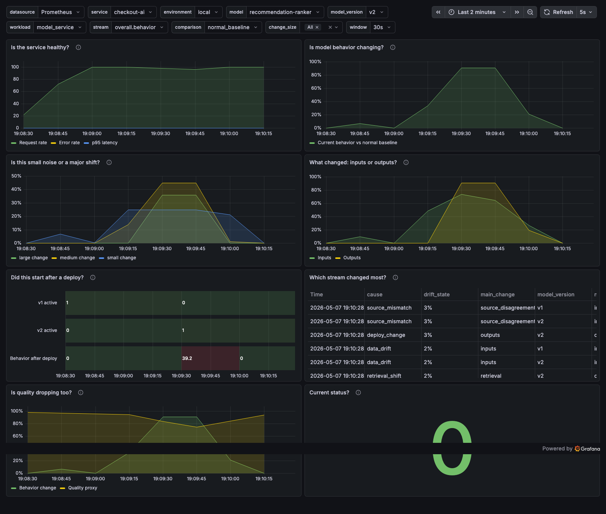

# MetricChrono MLOps / AI Observability Recipe

This recipe shows how to monitor AI behavior drift before labels arrive.

You will run a local model-service scenario where traffic, latency, and errors stay normal while the model's behavior changes. The dashboards show whether the change came from inputs, outputs, retrieval, agent workflow, or a deploy.

The default local run plays the two-minute scenario once and then holds recovery. Restart the stack to replay it, or run `npm run mlops:serve -- --loop` when you explicitly want a looping demo.



## Plug MetricChrono Into Your Service

The adapter in `examples/python/metricchrono_mlops_adapter.py` shows the intended integration shape. Copy it into your service, then:

```python
from metricchrono_mlops_adapter import (
    BehaviorMonitor,
    MLBehaviorEvent,
    emit_prometheus_metrics,
)

def build_monitor(baseline_events: list[MLBehaviorEvent]) -> BehaviorMonitor:
    return BehaviorMonitor.from_baseline_events(baseline_events)


def observe_model_request(
    monitor: BehaviorMonitor,
    *,
    service: str,
    environment: str,
    model: str,
    model_version: str,
    latency_seconds: float,
    error: bool,
    input_features: dict[str, float],
    embedding: list[float],
    output_distribution: dict[str, float],
    baseline_age_seconds: float,
    retrieved_ids: list[str] | None = None,
    agent_steps: list[str] | None = None,
    source_scores: dict[str, float] | None = None,
    quality_proxy: float = 100.0,
    previous_model_scores: dict[str, float] | None = None,
) -> str:
    snapshot = monitor.observe(MLBehaviorEvent(
        service=service,
        environment=environment,
        model=model,
        model_version=model_version,
        phase="live",
        latency_seconds=latency_seconds,
        error=error,
        input_features=input_features,
        embedding=embedding,
        output_distribution=output_distribution,
        retrieved_ids=retrieved_ids or [],
        agent_steps=agent_steps or [],
        source_scores=source_scores or {},
        quality_proxy=quality_proxy,
    ))
    comparisons = {"previous_model_version": previous_model_scores} if previous_model_scores else None
    return emit_prometheus_metrics(
        snapshot,
        baseline_age_seconds=baseline_age_seconds,
        comparison_scores=comparisons,
    )
```

See [the integration guide](docs/integration-guide.md), [baseline and calibration guide](docs/baseline-calibration.md), and [alert tuning guide](docs/alert-tuning.md).

## Three Terms

Change score:
  0-100 measure of how much behavior moved from a reference.

Comparison:
  What current behavior is compared against: normal baseline, last window, or previous model version.

Change size:
  Small, medium, or large movement. Small often means noise; large usually deserves investigation.

## What You Should See

Normal:
  Service health is normal and behavior change is low.

Small Input Noise:
  Small change rises, but large change stays quiet.

Gradual Data Drift:
  Input and embedding change increase over time.

Model Change:
  Behavior change spikes near the model-version marker.

Recovery:
  Behavior change falls and status returns toward Normal.

Run this MLOps recipe server from the repository root:

```bash
npm run mlops:start
```

Open the Grafana URL printed by the command. The dashboards are provisioned in the `MetricChrono MLOps Recipes` Grafana folder.

Run only this MLOps recipe with Docker instead:

```bash
docker compose up
```

Regenerate MLOps assets as a maintainer:

```bash
npm run mlops:generate
npm run mlops:capture
npm run mlops:validate
npm run mlops:live
```

Advanced: [how MetricChrono computes change scores](docs/metricchrono-internals.md).

This recipe is not a production observability platform. MetricChrono is the measurement engine underneath the dashboard, not a replacement for clocks, labels, causal models, full drift platforms, or production incident policy.
