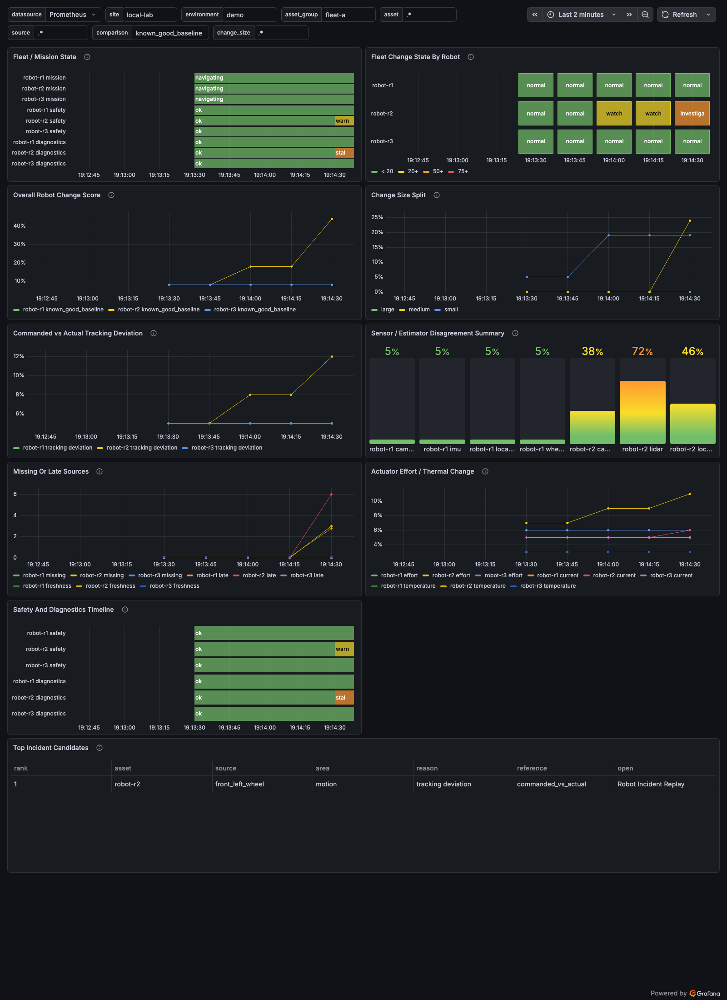

# MetricChrono Robotics Telemetry Recipe

This recipe helps robotics engineers see when a robot's motion, estimator, sensors, or actuators changed meaningfully while ordinary telemetry may still look normal.

The local demo is synthetic and deterministic. It does not require ROS, ROS bags, a robot, a fleet manager, or a live sensor stack. The default run plays once and holds recovery; pass `--loop` only when you explicitly want a repeating demo.



## Run The Grafana Demo

From the repository root:

```bash
make robotics
```

npm equivalent:

```bash
npm run robotics:start
```

Open the Grafana URL printed by the command. The dashboards are provisioned in the `MetricChrono Robotics Recipes` Grafana folder.

## Run The Fixture Scenario

```bash
cd recipes/robotics-telemetry/examples/synthetic-robot-scenario
python3 run_scenario.py
```

The script writes `scenario-metrics.prom` as a Prometheus text snapshot for each phase. Use `fixtures/expected-metrics-normal.txt` and `fixtures/expected-metrics-incident.txt` as deterministic expected output.

## Three Terms

Change score:
0-20: normal variation
20-50: watch
50-75: investigate
75-100: incident candidate

Comparison:
The reference used to judge current behavior. This recipe uses domain comparisons such as `known_good_baseline`, `last_window`, `same_mission_phase`, `peer_asset`, `commanded_vs_actual`, `sensor_vs_estimator`, `source_vs_source`, and `actuator_vs_peer_actuator`.

Change size:
`small` = jitter / noise / early movement, `medium` = operational deviation worth watching, and `large` = regime shift or incident candidate.

## What Ships

Default dashboards:
- Robot Fleet Overview
- Robot Source Agreement
- Robot Incident Replay

Out-of-the-box concepts:
pose / odometry, commanded velocity, actual velocity, tracking error, localization confidence, source freshness, perception confidence, motor current, motor temperature, battery or power state, diagnostics, mission state, and safety state.

## Boundaries

This open recipe ships generic dashboard JSON, local synthetic scenarios, a metric contract, baseline guidance, alert examples, a panel guide, screenshots, and bounded demo fixtures. It does not control, halt, or safely operate robots. It does not replace safety systems, robot controllers, ROS diagnostics, fleet managers, or incident policy.

See `docs/integration-guide.md`, `docs/metric-contract.md`, `docs/baseline-calibration.md`, `docs/alert-tuning.md`, and `docs/troubleshooting.md`.
