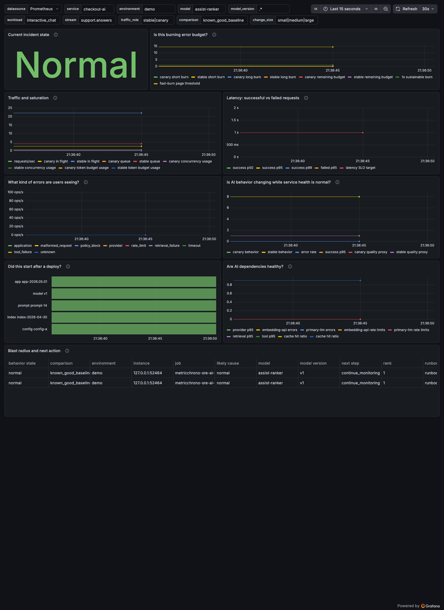

# AI Service Reliability Recipe

This recipe is for SREs and observability engineers running AI services. It helps on-call engineers triage AI-service incidents with golden signals, SLO burn, deploy correlation, dependency health, and AI behavior-change evidence.

It adds AI-behavior evidence beside golden signals and SLO burn. It does not replace SLOs, incident policy, full ML evaluation, tracing, or human review. Behavior-change alone is a watch signal by default, not a page.



## What Incident Does This Help With?

Use it when users report an AI service changed behavior, a canary looks suspicious, or a normal service incident might actually be infrastructure, dependency, deploy, retrieval, agent workflow, or behavior-related.

The first dashboard to open is `AI Service On-Call Overview`.

## Run The Local Scenario

```bash
make sre
```

npm equivalent:

```bash
npm run sre:start
```

Open the Grafana URL printed by the command. The dashboards are provisioned in the `MetricChrono SRE AI Services Recipes` Grafana folder.

To replay only the deterministic Prometheus text scenario:

```bash
cd recipes/sre-ai-services/examples/synthetic-ai-service-scenario
python3 run_scenario.py
```

## Dashboards Included

- AI Service On-Call Overview
- AI Incident Triage
- AI Release Guardrail

## Alerts Included

- `AIServiceFastBurn`
- `AIServiceSlowBurn`
- `AIServiceLatencyDegraded`
- `AIProviderDependencyDegraded`
- `AIBehaviorChangedWhileServiceHealthNormal`
- `AIBehaviorChangeWithQualityDrop`
- `AIReleaseBehaviorRegression`
- `AIBaselineStaleOrLowVolume`

## Local Scenario Phases

Normal, infrastructure/capacity issue, dependency/provider issue, silent AI-behavior change, deploy-correlated behavior change, behavior plus quality drop, stale baseline, low traffic, and recovery.

## What To Do When Behavior Changes But Service Health Is Green

Treat it as watch-level evidence. Check deploys, prompt/model/index/config changes, input shift, retrieval shift, agent workflow, baseline freshness, and sample volume. Route the evidence to the AI/model owner instead of restarting infrastructure first.

## Production Mapping

See `docs/production-mapping.md` for how to map these example metrics to production Prometheus, OpenTelemetry, Grafana Cloud, Datadog, Splunk, or custom observability pipelines.
